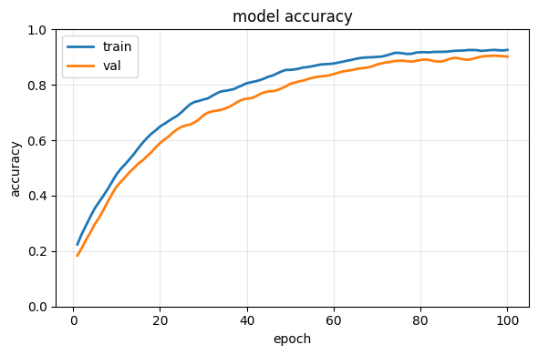
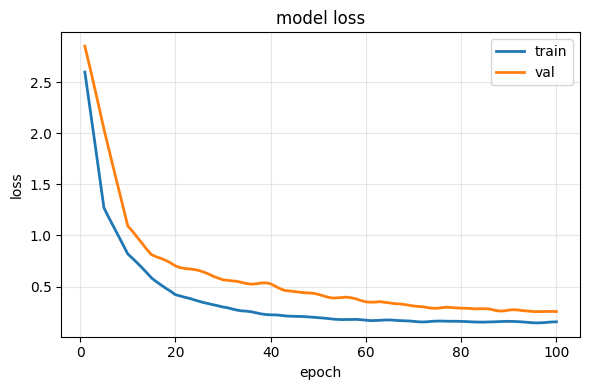

# SoundSort: Deep Learning Music Genre Classification Platform


- [Overview](#overview)
- [Problem Statement](#problem-statement)
- [Objectives](#objectives)
- [Supported Genre Classes](#supported-genre-classes)
- [System Architecture](#system-architecture)
- [Core Features](#core-features)
- [Technology Stack](#technology-stack)
- [Local Setup](#local-setup)
  - [Prerequisites](#prerequisites)
  - [1. Backend](#1-backend)
  - [2. Frontend](#2-frontend)
- [API Documentation](#api-documentation)
  - [`GET /health`](#get-health)
  - [`POST /predict`](#post-predict)
  - [`POST /predict-stream`](#post-predict-stream)
- [Inference Pipeline Details](#inference-pipeline-details)
- [Dataset Preparation and Training Utilities](#dataset-preparation-and-training-utilities)
- [Evaluation Artifacts](#evaluation-artifacts)
  - [Model Accuracy](#model-accuracy)
  - [Model Loss](#model-loss)
- [Operational Notes](#operational-notes)


## Overview

SoundSort is an end-to-end music genre classification system built with a CNN-based audio pipeline, a FastAPI backend, and a Next.js frontend dashboard.

The platform accepts MP3 files, transforms each file into a mel spectrogram, runs CNN inference, and returns:

- predicted genre label
- confidence score
- full probability distribution across supported classes

The frontend supports batch uploads, real-time pipeline progress updates, filtering, and CSV export for reporting.

## Problem Statement

Manual genre tagging across large audio libraries is error-prone and time-consuming. SoundSort addresses this by automating classification using deep learning and exposing results through a practical web interface suitable for batch workflows.

## Objectives

1. Build a reproducible preprocessing and spectrogram generation pipeline.
2. Train and serve a CNN model for multi-class music genre classification.
3. Provide low-friction batch inference through a web UI.
4. Surface interpretable outputs for downstream analysis and reporting.

## Supported Genre Classes

- blues
- classical
- country
- disco
- hiphop
- metal
- pop
- reggae
- rock

## System Architecture


## Core Features

- Multi-file MP3 upload and queue management.
- Streaming progress updates using SSE via `/predict-stream`.
- Automatic fallback from streaming endpoint to standard batch endpoint.
- Dashboard summary statistics:
  - average confidence
  - top genre
  - detected class count
  - processing success rate
- Dual result presentation (card and table views).
- Client-side CSV export of inference outputs.
- Backend health polling from the navigation bar.


## Technology Stack

| Layer         | Tools                                                         |
| ------------- | ------------------------------------------------------------- |
| Frontend      | Next.js 16, React 19, TypeScript 5, Tailwind CSS 4, DaisyUI 5 |
| Backend       | FastAPI, Uvicorn, python-multipart                            |
| ML / Audio    | TensorFlow/Keras, NumPy, librosa, pydub, matplotlib, Pillow   |
| Data Pipeline | pandas, tqdm, soundfile                                       |

## Local Setup

### Prerequisites

- Python 3.9+
- Node.js 20+
- npm 10+
- FFmpeg available on system PATH (required for MP3 decoding with pydub)

### 1. Backend

```bash
cd backend
python -m venv .venv
.\.venv\Scripts\activate
pip install -r requirements.txt
uvicorn main:app --reload --host 0.0.0.0 --port 8000
```

Backend base URL: `http://localhost:8000`

### 2. Frontend

```bash
cd frontend
npm install
npm run dev
```

Frontend URL: `http://localhost:3000`

## API Documentation

### `GET /health`

Health check endpoint.

Response:

```json
{
  "status": "ok"
}
```

### `POST /predict`

Consumes multipart form-data with one or more files under key `files`.

Response shape:

```json
{
  "results": [
    {
      "filename": "track.mp3",
      "genre": "rock",
      "confidence": 0.91,
      "probabilities": {
        "blues": 0.01,
        "classical": 0.00,
        "country": 0.01,
        "disco": 0.01,
        "hiphop": 0.02,
        "metal": 0.03,
        "pop": 0.01,
        "reggae": 0.00,
        "rock": 0.91
      }
    }
  ]
}
```

### `POST /predict-stream`

Streams Server-Sent Events (SSE) while each file moves through inference stages.

Example event payload:

```json
{
  "file": "track.mp3",
  "index": 0,
  "total": 4,
  "step": "generating_spectrogram",
  "progress": 60
}
```

The stream concludes with:

```json
{
  "done": true
}
```

## Inference Pipeline Details

For each uploaded MP3:

1. Validate file extension (`.mp3`).
2. Convert MP3 to WAV.
3. Extract analysis segment:
   - 40s to 50s if track duration is at least 50s
   - else first 10s if duration is at least 10s
   - else full available clip
4. Generate mel spectrogram image.
5. Resize and normalize image for CNN input.
6. Produce softmax probabilities and top class prediction.

CNN input shape used at inference time: `288 x 432 x 4`.

## Dataset Preparation and Training Utilities

The preprocessing pipeline under `training/utility` supports conversion of FMA metadata and audio into spectrogram image datasets.

Typical preprocessing command:

```bash
cd training/utility
python preprocess.py --fma_dir D:\path\to\fma --output_dir D:\path\to\spectrograms --subset small --split training validation test --workers 4
```

Expected outputs include:

- split-by-genre spectrogram image directories
- `preprocessing_report.csv`
- `class_map.csv`

## Evaluation Artifacts

Training metric plots are available in `training/results`.

### Model Accuracy



### Model Loss



Formal project report:

- [DL-Project-Report-A1&A13.pdf](report/DL-Project-Report-A1&A13.pdf)

## Operational Notes

- The backend loads model weights from `training/Model.h5` at startup.
- The frontend expects backend API at `http://localhost:8000`.
- CORS is configured for local frontend origins (`localhost:3000` and `127.0.0.1:3000`).
